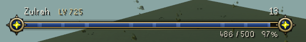
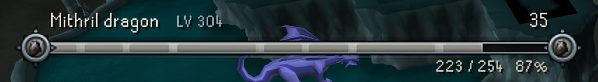
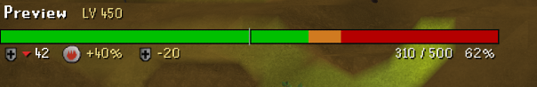

# Boss Health Bar Additions

A bigger, themed health bar for the boss you're fighting, with a damage trail and the damage of your latest attack.

See the [changelog](CHANGELOG.md) for what's new in each version.

## What it does

- Shows a wide bar with the opponent's name, combat level and hitpoints
- When you land a hit, the health you took off stays visible as a lighter trail for a moment before it drains, so you can see how big the hit was
- Adds your recent hits up into a number next to the bar. It can also count your RuneLite party's hits
- The fill changes colour as health drops and pulses when it's low
- God themes put that god's icon at both ends of the bar. The custom theme lets you pick your own colours and any item as the icon
- Use Oldschool theme switches to a plain green bar over red with a thin dark outline, closer to the game's own health bars. See [Oldschool theme](#oldschool-theme) for what applies to it
- You can lay one of the game's own textures over the fill, on any theme, but not with Use Oldschool theme on

It only shows what the game already tells you. No timers, attack prediction or anything like that.

## Which opponents get a bar

By default only bosses do. The plugin has a [list of commonly fought bosses](docs/bosses.md), and it also picks up anything the game's own boss health bar is showing, plus superior slayer monsters. If a boss is missing, turn on "Also show above combat level", or turn off "Only show for bosses" to get the bar on everything.

If you attack something smaller during a boss fight, like the minions some bosses spawn, the bar stays on the boss.

The bar stays while the fight is going on, even if you stop attacking to move or eat. "Hide after" counts from when you stop attacking or from the last hit on the opponent or on you, whichever is later. Hits only count while the opponent is within 15 tiles of you. Blocked hits count, poison and other damage over time don't.

Switching between opponents that both get a bar, like the NPCs of a boss fought as a group, moves the bar over without playing the intro again. The game only shows an NPC's health once it's been hit, so until then the bar keeps showing the previous one, for up to 3 seconds.

Superior slayer monsters are recognised by their NPC ID, from a list the plugin keeps. For a superior that isn't on the list yet, the plugin watches for the chat message when one spawns and uses the NPC that spawned near you at the same time. If more than one did, it doesn't guess and none gets the bar.

## Settings

Everything is in the normal RuneLite config screen, or right-click the bar and pick Configure. Preview, at the top, shows a sample opponent that loses and regains health, so you can try settings without fighting anything. Look and Text are open by default, the other sections are folded.

Look

- Theme picks the bar's colors. Custom starts from the theme you had and uses the Custom colors section
- Use Oldschool theme (off by default) switches to the plain Oldschool bar. See [Oldschool theme](#oldschool-theme)
- Match boss colors (off by default) gives each boss its own bar colors, on any theme. A boss keeps the same colors in every form
- Rare gold bars (on by default) turns about 1 in 250 bars gold, with a shine and a few sparkles. It's rolled once per opponent and is only for looks
- Show icons (on by default) shows the icon in a crest at both bar ends, or small before the name with Use Oldschool theme on
- Use boss icon (on by default) uses the boss's hiscores icon instead of the theme's. Raid bosses show their pet. Needs Show icons
- Bar ends picks the ornament at each end of the bar. Classic (the default) has an end piece with a diamond. Subtle curves the frame into a small bracket with curled tips. The ends only show with Show icons off, since the icon crests cover them
- Choose fill texture opens a picker with the game's own textures to lay over the fill. It's in the bar's right-click menu too
- Show phase markers shows the same phase markers as the game's own boss health bar
- Bar width and Bar height, in pixels. Holding Alt and dragging the bar's edge overrides the width until you reset the overlay
- Fit to game view makes the bar narrower when the game view is small

Text

- Name font, Damage number font, Combat level font, Hitpoints font, Kill count font, Party defence font, Special attack counts font, Elemental weakness font and Defence drain limit font each pick the font, size, bold and italic of that text. Hitpoints font also sets "Defeated", and Party defence font also sets Magic defence. Icons next to an item grow and shrink with its font, and a row gets taller to fit its largest text. The defaults are the game's RuneScape font, with RuneScape Small for the smaller text. The RuneScape fonts are drawn at any size you set, but at some sizes they can look a little uneven
- If you used another font before these settings existed, the new ones are set once to match the look you had
- Show name, Show combat level and Hitpoints text (percentage, value, or both)
- Smooth text (on by default) smooths the edges of the text. Turn it off for sharp text when the game is scaled up, for example with xBR. The RuneScape fonts are never smoothed
- Show damage number shows the damage of your latest attack. Hits that land together, like a multi-hit special attack, are added up
- Damage number counts picks whose hits it adds up. Me (the default) shows your latest attack. Party keeps a running total of your RuneLite party's hits while they keep coming, and starts over after 2.5 seconds without one. It only counts members who also have this plugin. Outside a party, Party works like Me

Boss info (folded by default)

- Kill count (off by default) shows your kill count for the boss. It uses the counts RuneLite's Chat Commands plugin saves, so that plugin needs to be on, and a boss shows nothing until it has seen a kill count message for it. Raid bosses show nothing, since the count belongs to the whole raid
- Elemental weakness (on by default) shows the element's rune and the extra damage the boss takes from it, for example +40%
- Defence drain limit (on by default) shows how far the boss's defence can be lowered in total, for example -20, or "no drain". It's a fixed value per boss form
- Special attack counts (on by default) shows the counts from RuneLite's Special Attack Counter plugin with each weapon's icon. Some weapons count damage instead of hits. Needs that plugin on with its info boxes. If the weapons don't all fit, none are shown. They don't show while the Better Party Defence plugin is on, since it hides those info boxes
- Party defence (on by default) shows the defence from the Party Defence Tracker or Better Party Defence plugin's info box, with the Defence icon and a red down arrow. With Party Defence Tracker it shows once that plugin has an info box for your opponent. If both are on, Better Party Defence is used, since it hides the other plugin's info box. Better Party Defence's info box doesn't say which NPC it's for, so it shows the defence of the boss that plugin is tracking, which may not be the NPC you're attacking (for example a minion during a boss fight)
- Magic defence (on by default) shows the magic defence from the Better Party Defence plugin's Magic defence info box, with the Magic icon and a red down arrow, right after Party defence and in the same Layout spot. It only shows with that plugin's Magic defence info box turned on, and that box usually only appears after a special attack that lowers magic defence, unless that plugin is set to always show it. Like Party defence, it's for the NPC that plugin is tracking. The two boxes are told apart by their icon. In the rare case that a resource pack's Magic icon isn't recognised, Magic defence shows nothing and Party defence may show the magic value

Animations (folded by default)

- Damage trail keeps the lost health visible as a lighter section for a moment after a hit
- Heal speed sets how quickly the bar refills when the opponent heals. Damage always lowers it immediately
- Low health effect and Low health threshold make the fill pulse and glow when health is low
- Flash on big hits and Intro animation
- Defeat animation holds the empty bar with a "Defeated" label before it goes
- Burn away (off by default) burns the bar away from right to left behind a glowing edge instead of fading it out. Only used with Defeat animation on

Layout (folded by default)

- Each item around the bar has a dropdown for where it goes: top left, top centre or top right above the bar, or the same three below it. The Text and Boss info settings still decide whether an item shows, these only decide where. The defaults are the classic layout: name top left, damage number top right, hitpoints bottom right, everything else bottom left
- Items in the same spot line up next to each other. The more important item sits closer to the edge, in this order: name, hitpoints, damage number, kill count, party defence, magic defence, special attack counts, elemental weakness, defence drain limit. A centre spot reads left to right in that order
- When a row gets full, space goes to the more important items first. An item that doesn't fit is left out, along with the less important items after it in the same spot, so nothing jumps into its place. The name is never left out, it's shortened instead
- "Defeated" shows centred on whichever row Hitpoints is on. The hitpoints keep their space meanwhile, so nothing moves, and "Defeated" is left out if something else is already in the middle of that row
- If nothing is set to go above or below the bar, that row takes up no space

Custom colors (folded by default)

- Choose custom icon picks the item shown at the bar ends on the Custom theme. It's in the bar's right-click menu too. The search opens in your chatbox, so you need to be logged in
- The colors the Custom theme uses

When to show (folded by default)

- Only show for bosses, Also show above combat level, Minimum combat level and Superior slayer monsters pick which opponents get a bar (see above)
- Hide after sets how long the bar stays once the fight goes quiet
- Game's boss health bar decides what happens for bosses that show the game's own health bar at the top of the screen. Replace it (the default) hides the game's bar and uses its numbers on this one. Show both keeps the game's bar and shows this one too. Hide this bar keeps the game's bar and leaves this one out of those fights
- Hide Opponent Information bar (on by default) turns off the health bar from RuneLite's Opponent Information plugin so you don't see two. Your own setting comes back when you turn this plugin off
- Boss Health Indicators lines (on by default): if you use the Boss Health Indicators plugin, the health lines you set up there are drawn on this bar too, in your colours. Without this they'd be lost when this bar replaces the game's bar

Hold Alt to move the bar, or drag its edge to make it wider or narrower. Alt + right-click and Reset puts it back.

## Oldschool theme

Tick Use Oldschool theme in the Look section for a simpler bar in the style of the game's own health bars. While it's on, the Theme dropdown isn't used. It has:

- A flat green bar over red with a thin dark outline, and plain text
- The boss's icon, small before its name, with Show icons and Use boss icon on
- The damage trail, heals, the low health pulse (without the glow), flash on big hits, phase markers and Boss Health Indicators lines
- The intro and defeat animations, Burn away included, and every Text, Boss info and Layout option

These don't apply to it:

- Fill texture and the Custom colors section. They stay saved and come back when you untick it. Picking Custom in the Theme dropdown while it's on starts the Custom colours from the theme the dropdown had before
- The end pieces (whichever Bar ends is set to), crest and shine

Match boss colors and Rare gold bars don't fit this bar, so ticking Use Oldschool theme turns them off, and unticking it turns them back on as you had them. If you tick either of them while it's on, Use Oldschool theme turns off instead, and the other one goes back to how you had it. RuneLite's settings panel can't grey out settings, so the plugin changes these checkboxes itself.

## Data

The elemental weaknesses and defence drain limits come from the [Old School RuneScape Wiki](https://oldschool.runescape.wiki) and are built into the plugin, so it doesn't go online for them. [Supported bosses](docs/bosses.md) lists the values for each boss.

## Contact

Questions or ideas? Reach me on Discord at comrade9932 (Kuringe), or in game at Ultra Cringe.

## License

BSD 2-Clause, see [LICENSE](LICENSE).
